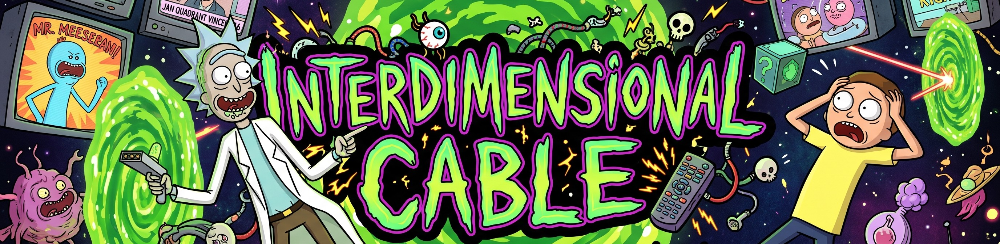
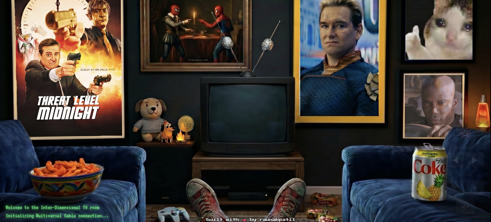
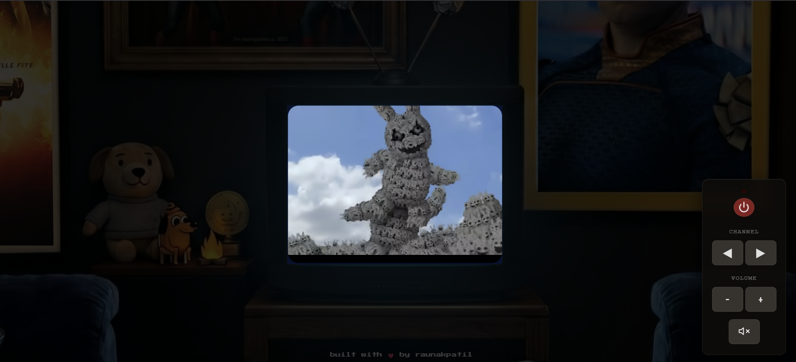
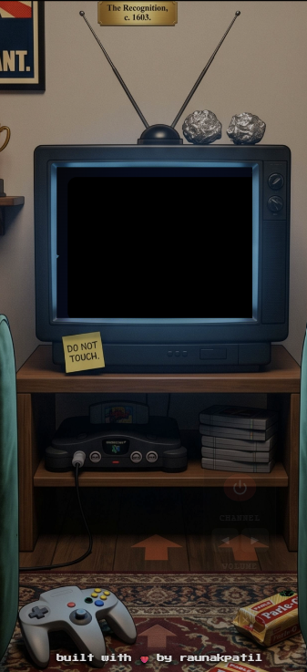
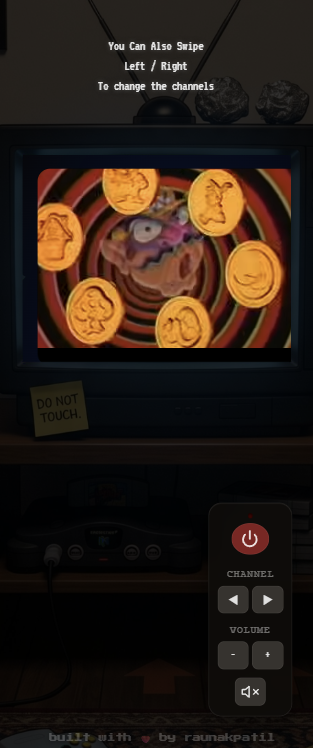

# 📺 Interdimensional Cable



> An immersive, nostalgic analog TV simulator for exploring curated YouTube rabbit holes.

[](https://raunakpatil.github.io/InterdimentionalCable/)
[](https://developer.mozilla.org)
[](https://developer.mozilla.org)
[](https://developers.google.com/youtube/iframe_api_reference)

---

> **Most video aggregators are just grids of thumbnails.**
> This project asks: *what if you were sitting on the floor in 1998, flipping through mysterious analog channels on a glowing CRT television?*

---

## 📸 Demo

### 📻 Ambient Power-Off State


### 📺 Immersive CRT Experience


### 📱 Mobile Power-Off State


### 📲 Mobile Native Experience


---

## ✨ Features

| Feature | What it does |
|---------|--------------|
| 📺 **Authentic CRT Simulation** | Curved glass, phosphor bloom, scanlines, and RGB split effects built purely in CSS. |
| 📻 **Seamless Channel Surfing** | Custom YouTube API integration with pre-fetching for instant channel switching. |
| 🎬 **Cinematic Power Sequence** | Glowing boot text, static bursts, audio cues, and a creeping cinematic zoom-in effect. |
| 📱 **Mobile Optimized** | Flawless responsive layout, gesture support (swipe to change channel), and a tailored UI that fits portrait screens perfectly. |
| 🎭 **Dynamic Static Engine** | HTML5 Canvas generating randomized 60fps noise, tracking hum, and V-Sync drops, tied together with procedural Web Audio API static. |
| 🧠 **Intelligent Video Rotation** | "Offline Vault" fallback system automatically preempts YouTube end-screens, keeping the immersion completely unbroken. |

---

## 🛠 Tech stack

| Layer | Technology |
|-------|-----------|
| Core Logic | Vanilla JavaScript (ES6+) |
| Media Player | YouTube IFrame Player API |
| Aesthetics & UI | Vanilla CSS3 (Custom Variables, Keyframe Animations, Mix-Blend-Modes) |
| Visual Effects Engine | HTML5 Canvas API |
| Audio Engine | Web Audio API (Procedural Static Generation) |

---

## 🚀 Setup & Installation

Since the project is built entirely in Vanilla JS and CSS with no build steps or dependencies, getting it running is completely friction-free:

1. **Clone the repository**
   ```bash
   git clone https://github.com/raunakpatil/InterdimentionalCable.git
   ```

2. **Serve locally**
   You can run it using any simple local server (like Python's HTTP server or VS Code Live Server):
   ```bash
   cd InterdimentionalCable
   python -m http.server 8080
   ```

3. **Open in browser**
   Navigate to `http://localhost:8080` to tune in.

---

## 🔧 Architecture Overview

* **`app.js`**: Core state machine handling power sequences, gesture controls (swiping), remote control UI, and global event listeners.
* **`youtube.js`**: Manages the YouTube IFrame API lifecycle, dynamically loads the `FALLBACK_VAULT`, and continuously monitors playback to prevent YouTube's UI from breaking immersion.
* **`effects.js`**: Houses the HTML5 Canvas static noise generator and coordinates the `vhs-static-chaos` CSS animations during channel switches.
* **`sounds.js`**: Synthesizes procedural white noise using the Web Audio API and manages sound effects (button clicks, TV power).
* **`style.css`**: The true heavy lifter—creating the 3D television bevel, curved CRT glass, scanlines, and all cinematic transitions natively.

---
